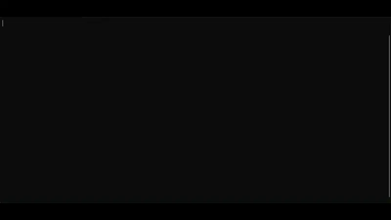

## Hey there! 👋  
I'm **Giacomo Guaresi**, a passionate software developer with a love for coding, electronics 🔌 and systems engineering 🧰.  
I enjoy building innovative solutions, exploring new technologies, and collaborating in open-source communities.

## 🧠 About Me

- 🔭 Currently working on full-stack projects and cloud-based architectures  
- 💡 Interested in embedded systems, DevOps, and creative coding  
- 🌱 Always learning something new – from algorithms to PCB design!  
- 🛠 Tinkerer at heart: from code to circuits  

## 🧰 Tech Toolbox

### 🖥️ Operating Systems

 

### 💬 Languages

      

### 🌐 Web & Frameworks

  

## 📊 GitHub Stats

  
    
  

## ☕ Let's Connect

 
 
 

> _“Code is like humor. When you have to explain it, it’s bad.”_ – Cory House
