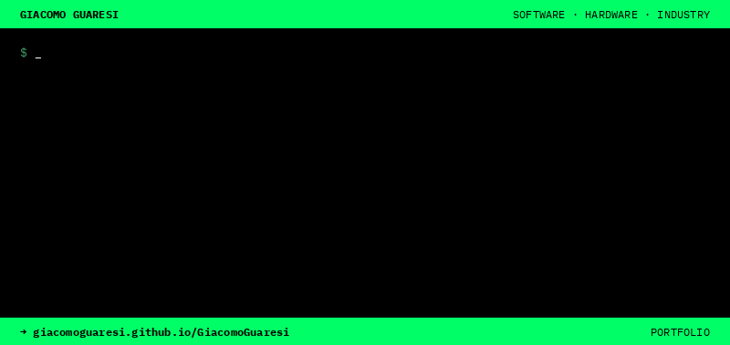
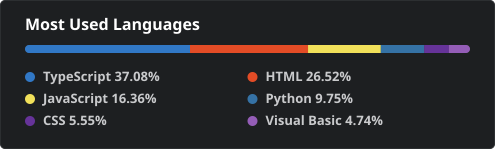
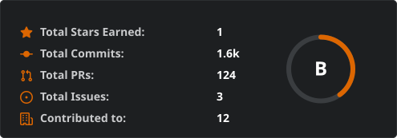

### [giacomoguaresi.github.io/GiacomoGuaresi](https://giacomoguaresi.github.io/GiacomoGuaresi)

---

## Software · Hardware · Industry

I build the software that runs machines, and the electronics it runs on.
Firmware, boards, control systems and the backends around them — from schematic
to production.

Based near Milan, Italy. Open to remote or hybrid roles in development and R&D.

**Right now** I work at a startup building industrial pellet-fed 3D printers,
where I own the software and IT side end to end: printer firmware and control
stack, custom PCBs, Linux images and kernels, internal tooling, and the servers
underneath. I contribute to [OrcaSlicer](https://github.com/SoftFever/OrcaSlicer),
[Klipper](https://github.com/Klipper3d/klipper) and
[Mainsail](https://github.com/mainsail-crew/mainsail) — the open-source projects
at the core of the machine.

**Before that**: four years of SCADA and R&D inside Italian pharmaceutical
plants under GMP and ISO 9001, and a stretch of enterprise consulting on
containerised cloud stacks.

## Stack

| | |
|---|---|
| **Electronics** | Schematic design · PCB routing · Design for production · EasyEDA |
| **Embedded** | C · C++ · STM32 · ESP32 · Arduino · CAN bus · Embedded Linux · Custom kernels |
| **Industrial** | SCADA (iFIX, Movicon) · Modbus · OPC-UA · Profinet · EtherCAT · MQTT · GMP |
| **Additive** | Klipper · Mainsail · OrcaSlicer · Slicing and G-code |
| **Backend** | C# / .NET · Node.js · Spring · Python · REST APIs · OAuth · Kafka · Redis |
| **Data** | PostgreSQL · MySQL · Oracle · MongoDB · SQLite · Process historians |
| **Systems** | Linux · Docker · GitHub Actions · GitLab CI · Production deploys |
| **Frontend** | React · Angular · TypeScript |
| **AI in production** | LLM integration with function calling · OpenCV · TensorFlow |

**Learning now:** KiCad · Kubernetes · Rust · agentic AI systems

## GitHub

  
    
  

