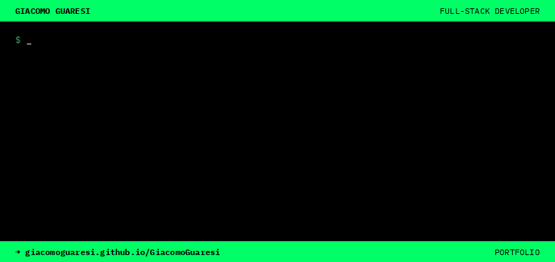
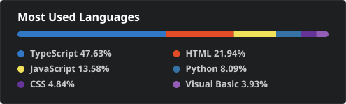
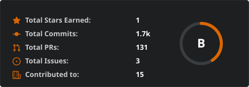

### [giacomoguaresi.github.io/GiacomoGuaresi](https://giacomoguaresi.github.io/GiacomoGuaresi)

---

## Full-Stack Developer

I build web applications end to end — React and TypeScript front ends, Node.js
and .NET back ends, PostgreSQL, Docker and CI/CD — with eight years of
production software and roots in industrial systems and IoT.

Based near Milan, Italy. Open to full-stack roles, hybrid or remote.

**Right now** I build and run the internal platform of a manufacturing startup:
around ten web applications in React, Node.js and PostgreSQL — project
management first among them, with an AI assistant built in on Gemini function
calling — plus the Linux servers, Docker deployments and CI pipelines
underneath. I also look after the software of the company's industrial 3D
printer and contribute upstream to [OrcaSlicer](https://github.com/SoftFever/OrcaSlicer),
[Klipper](https://github.com/Klipper3d/klipper) and
[Mainsail](https://github.com/mainsail-crew/mainsail).

**Before that**: full-stack consulting on enterprise React, Angular and
TypeScript applications over cloud-native back ends; four years of software for
Italian pharmaceutical plants — a .NET portal, mobile apps and near-terabyte
databases under GMP; and a Spring and PostgreSQL portal for an IoT product.

## Stack

| | |
|---|---|
| **Frontend** | React · TypeScript · JavaScript · Angular · HTML · CSS |
| **Backend** | Node.js · C# / .NET · Python · Java / Spring · REST APIs · OAuth · Kafka · Redis |
| **Data** | PostgreSQL · MySQL · MongoDB · Oracle · Redis · SQLite · Query tuning |
| **DevOps & cloud** | Docker · Kubernetes (managed) · GitHub Actions · GitLab CI · Linux · Production deploys |
| **AI** | LLM integration with function calling · OpenCV · TensorFlow |
| **Also** | Embedded & IoT: C / C++ · ESP32 · STM32 · CAN bus · MQTT · Modbus · OPC-UA · PCB design |

**Learning now:** Rust · agentic AI systems

## GitHub

  
    
  

